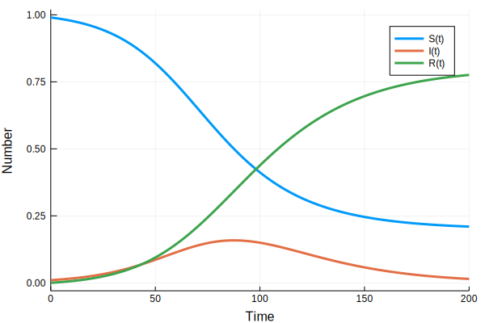

### SIR model in Julia using DifferentialEquations

*Author*: Simon Frost

*Date*: 2018-07-12


{:.input_area}
```julia
using DifferentialEquations
```


{:.input_area}
```julia
sir_ode = @ode_def SIRModel begin
    dS = -b*S*I
    dI = b*S*I-g*I
    dR = g*I
end b g
```


{:.output_data_text}
```
(::SIRModel) (generic function with 4 methods)
```


{:.input_area}
```julia
parms = [0.1,0.05]
init = [0.99,0.01,0.0]
tspan = (0.0,200.0)
```


{:.output_data_text}
```
(0.0, 200.0)
```


{:.input_area}
```julia
sir_prob = ODEProblem(sir_ode,init,tspan,parms)
```


{:.output_data_text}
```
DiffEqBase.ODEProblem with uType Array{Float64,1} and tType Float64. In-place: true
timespan: (0.0, 200.0)
u0: [0.99, 0.01, 0.0]
```


{:.input_area}
```julia
sir_sol = solve(sir_prob);
```


{:.input_area}
```julia
sir_out=sir_sol(linspace(tspan[1],tspan[2],2001));
```

#### Visualisation


{:.input_area}
```julia
using Plots
```


{:.input_area}
```julia
plot(sir_sol,xlabel="Time",ylabel="Number")
```





